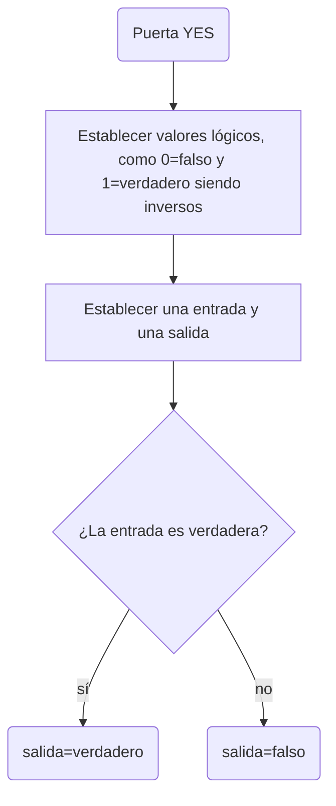
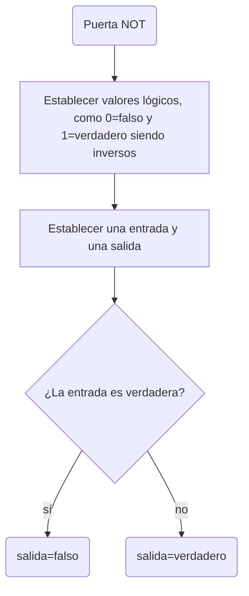
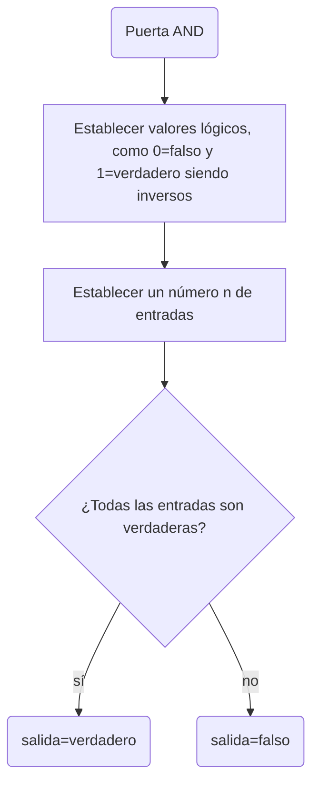
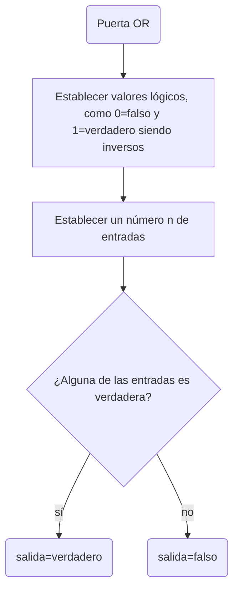
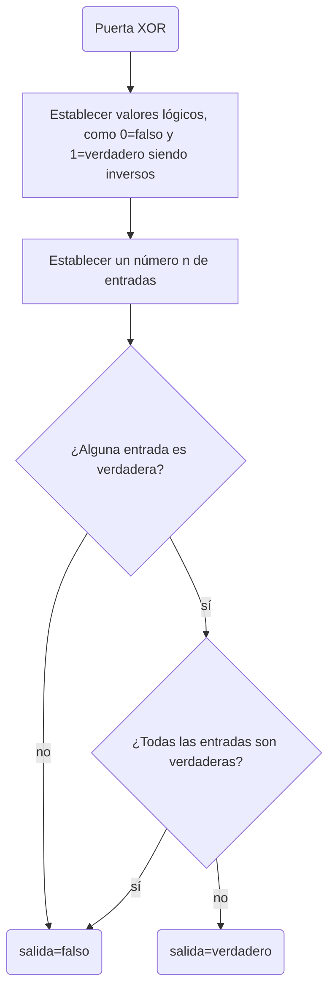
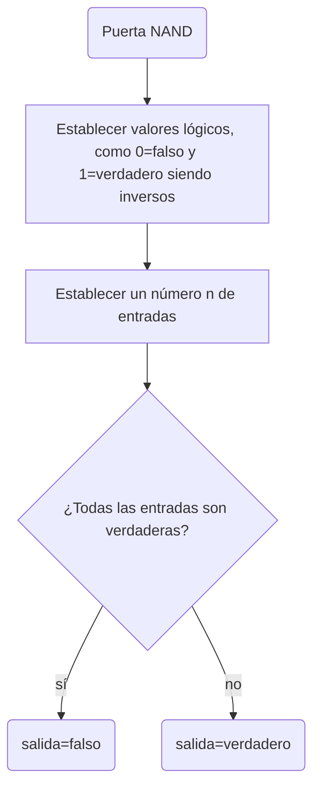
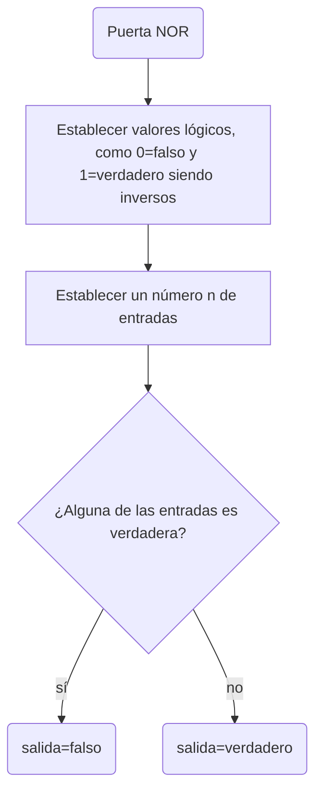
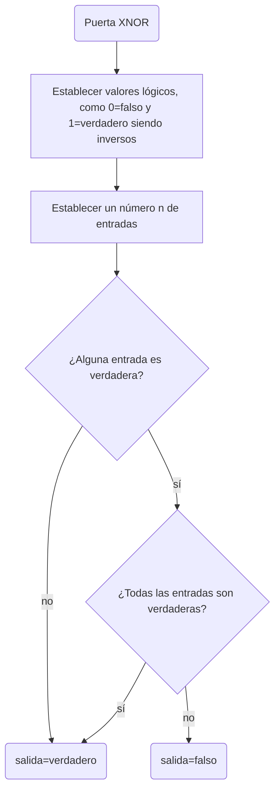
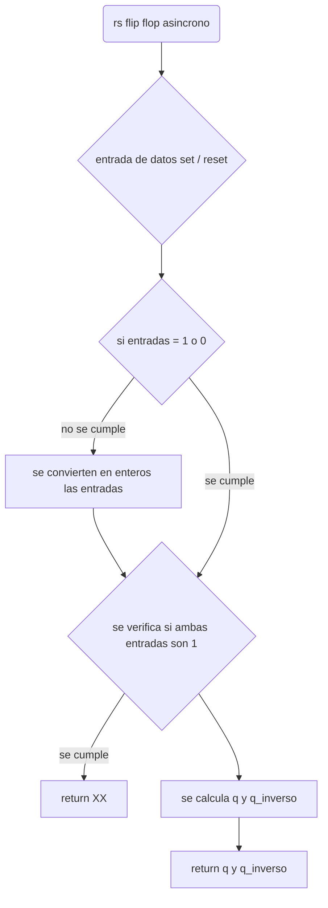
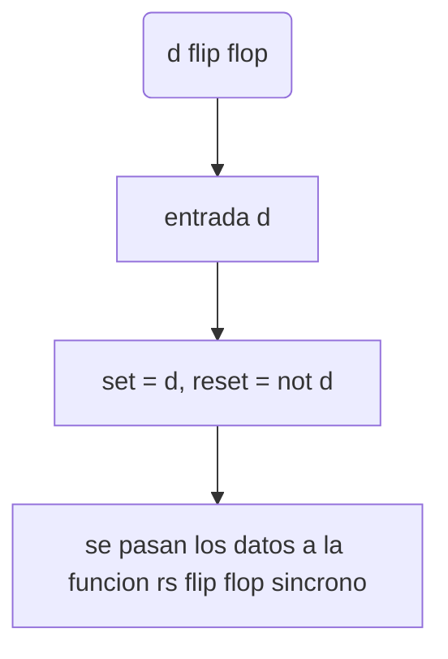

# proyecto_programacion_actualizado

<div align='center'>
<figure> </br>
<figcaption><b></b></figcaption></figure>
</div>

# proyecto_programacion

Este proyecto fue realizado para algo, aún no defnimos que, pero para algo, suponemos que para disdfrutar de programar

## diagramas y funcionamientos de las funciones

funcionamiento de las puertas logicas en el proyecto

## puertas logicas

Las puertas lógicas son componentes fundamentales en la electrónica digital. Se utilizan para realizar operaciones lógicas básicas en circuitos digitales y están basadas en el álgebra booleana.

#### puerta YES


<details><summary>explicacion</summary>
  
  ##### tabla de verdad:
  <table>
     <tr>
    <td> entrada </td> <td> salida </td> 
  </tr>
  <tr>
    <td> 0 </td> <td> 0 </td> 
  </tr>
  <tr>
    <td> 1 </td> <td> 1 </td> 
  </table>
<br>

##### Explicación: 

La puerta lógica YES considera una única entrada y una única salida, la salida tiene siempre el mismo valor que la entrada. Se puede recrear con un transistor.

#### Esta puerta lógica se puede programar de la siguiente manera:



</details>

### puerta NOT

<details><summary>explicacion</summary>
  - tabla de verdad:
  <table>
     <tr>
    <td> entrada </td> <td> salida </td> 
  </tr>
  <tr>
    <td> 0 </td> <td> 1 </td> 
  </tr>
  <tr>
    <td> 1 </td> <td> 0 </td> 
</table>
<br>

#### Explicación: 

La puerta lógica NOT considera una única entrada y una única salida, la salida tiene siempre el valor inverso al de la entrada. Esta puerta se utiliza para crear puertas como la NAND o la NOR entre otras, al colocarse en la salida de la puerta que se desea invertir. Se puede recrear con un transistor cuya salida conecta a tierra y un nodo previo al colector, donde se encuentra la salida lógica.

#### Esta puerta lógica se puede programar de la siguiente manera:



</details>

### puerta AND

<details><summary>explicacion</summary>
  
  #### tabla de verdad:
  <table>
     <tr>
    <td> a </td> <td> b </td> <td> salida </td>
  </tr>
  <tr>
    <td> 0 </td> <td> 0 </td> <td> 0 </td>
  </tr>
  <tr>
    <td> 0 </td> <td> 1 </td> <td> 0 </td>
  </tr>
     <tr>
    <td> 1 </td> <td> 0 </td> <td> 0 </td>
  </tr>
     <tr>
    <td> 1 </td> <td> 1 </td> <td> 1 </td>
  </tr>
</table>
<br>

#### Explicacion:

La puerta AND considera 2 entradas y una única salida en función de las entradas, encendiendose unicamente si ambas entradas están encendidas; en los otros casos la puerta se mantiene apagada. Se puede recrear con 2 transistores conectados en serie.

#### Esta puerta lógica se puede programar de la siguiente forma:



</details>

### puerta OR

<details><summary>explicacion</summary>
  #### tabla de verdad:
  <table>
     <tr>
    <td> a </td> <td> b </td> <td> salida </td>
  </tr>
  <tr>
    <td> 0 </td> <td> 0 </td> <td> 0 </td>
  </tr>
  <tr>
    <td> 0 </td> <td> 1 </td> <td> 1 </td>
  </tr>
     <tr>
    <td> 1 </td> <td> 0 </td> <td> 1 </td>
  </tr>
     <tr>
    <td> 1 </td> <td> 1 </td> <td> 1 </td>
  </tr>
</table>
<br>
  
#### Explicación:

La puerta OR considera 2 entradas y una única salida en función de las entradas, tal que si alguna de las dos entradas está encendida, la salida lógica también está encendida; el único caso en dónde la salida se encuentra apagada es si ambas entradas se encuentran apagadas. Se puede recrear con 2 transistores conectados en paralelo.

#### Esta puerta se puede programar de la siguiente forma:




</details>

### puerta XOR

<details><summary>explicacion</summary>
  
  #### tabla de verdad:
  <table>
     <tr>
    <td> a </td> <td> b </td> <td> salida </td>
  </tr>
  <tr>
    <td> 0 </td> <td> 0 </td> <td> 0 </td>
  </tr>
  <tr>
    <td> 0 </td> <td> 1 </td> <td> 1 </td>
  </tr>
     <tr>
    <td> 1 </td> <td> 0 </td> <td> 1 </td>
  </tr>
     <tr>
    <td> 1 </td> <td> 1 </td> <td> 0 </td>
  </tr>
</table>
<br>

#### Explicación: 

La puerta XOR considera 2 entradas y una única salida en función de las entradas, tal que si alguna de las dos entradas está encendida, la salida lógica también está encendida; su comportamiento es muy parecido al de la puerta OR, solo que a diferencia de esta, se apaga si ambas entradas se encuentran encendidas. Se puede recrear haciendo un cirucito híbrido entre la puerta AND y la OR(conectando ambos transistores tanto en serie como en paralelo), el circuito OR mantiene sus salidas originales, mientras que el circuito AND tiene la salida conectada a tierra.

#### Esta puerta se puede programar de la siguiente forma:



</details>

### puerta NAND

<details><summary>explicacion</summary>
  
  #### tabla de verdad:
  <table>
     <tr>
    <td> a </td> <td> b </td> <td> salida </td>
  </tr>
  <tr>
    <td> 0 </td> <td> 0 </td> <td> 1 </td>
  </tr>
  <tr>
    <td> 0 </td> <td> 1 </td> <td> 1 </td>
  </tr>
     <tr>
    <td> 1 </td> <td> 0 </td> <td> 1 </td>
  </tr>
     <tr>
    <td> 1 </td> <td> 1 </td> <td> 0 </td>
  </tr>
</table>
<br>

#### Explicacion:

La puerta NAND considera 2 entradas y una única salida en función de las entradas, siendo la versión negada de la puerta AND, esta enciende la salida mientras las dos entradas no se encuentren simultaneamente encendidas. Se puede contruir con los componentes de una puerta AND y una puerta NOT en la salida de estos.

#### Esta puerta lógica se puede programar de la siguiente forma:


</details>

### puerta NOR

<details><summary>explicacion</summary>

#### tabla de verdad:

  <table>
     <tr>
    <td> a </td> <td> b </td> <td> salida </td>
  </tr>
  <tr>
    <td> 0 </td> <td> 0 </td> <td> 1 </td>
  </tr>
  <tr>
    <td> 0 </td> <td> 1 </td> <td> 0 </td>
  </tr>
     <tr>
    <td> 1 </td> <td> 0 </td> <td> 0 </td>
  </tr>
     <tr>
    <td> 1 </td> <td> 1 </td> <td> 0 </td>
  </tr>
</table>
<br>
  
#### Explicación:

La puerta NOR considera 2 entradas y una única salida en función de las entradas, al tratarse de la negación de la puerta OR, esta se enciende unicamente si ambas entradas están encendidas. Se puede construir como una puerta OR seguida de una puerta NOT.

#### Esta puerta se puede programar de la siguiente forma:




</details>

### puerta XNOR

<details><summary>explicacion</summary>
  
  #### tabla de verdad:
  <table>
     <tr>
    <td> a </td> <td> b </td> <td> salida </td>
  </tr>
  <tr>
    <td> 0 </td> <td> 0 </td> <td> 1 </td>
  </tr>
  <tr>
    <td> 0 </td> <td> 1 </td> <td> 0 </td>
  </tr>
     <tr>
    <td> 1 </td> <td> 0 </td> <td> 0 </td>
  </tr>
     <tr>
    <td> 1 </td> <td> 1 </td> <td> 1 </td>
  </tr>
</table>
<br>

#### Explicación: 

La puerta XNOR considera 2 entradas y una única salida en función de las entradas; al tratarse de la negación de la puerta XOR, esta unicamente enciende la salida si ambas entradas están apagadas, o si ambas entradas se encuentran encendidas. El circuito para construirla se basa en contruir una puerta XOR y colocarle una puerta NOT en la salida

#### Esta puerta se puede programar de la siguiente forma:



</details>

## Flip flops

Los flip flops, biestables, o latch, son un circuito multivibrador(un tipo de circuito que puede generar una onda cuadrada), el cual pude almacenar 4 estados estables( estados en los cuales entrega información). Son las unidades básicas de memoria en lógica secuencial.

*pongamosle que sacado de wikipedia, de momento porque el profe no dijo que tocaba que utilizar fuentes*

<details><summary>rs flip flop (asincrono)</summary>
  
  #### tabla de verdad:
  <table>
   <tr>
    <td> r </td> <td> s </td> <td> q </td> <td> q` </td>
  </tr>
  <tr>
  <td> 0 </td> <td> 0 </td> <td colspan ="2"> sin cambios </td>
  </tr>
  <tr>
    <td> 1 </td> <td> 0 </td> <td> 1 </td><td> 0 </td>
  </tr>
     <tr>
    <td> 0 </td> <td> 1 </td> <td> 0 </td><td> 1 </td>
  </tr>
     <tr>
    <td> 1 </td> <td> 1 </td> <td colspan ="2"> estado invalido </td>
  </tr>
</table>
<br>

#### Explicación: 
Los flip flops RS asíncronos (sin reloj), son aquellos que pueden tener 4 estados, uno de set(o ajuste), uno de memoria(correspondiente al anterior), uno de reset(reajuste o borrado), el cual invierte las salidas del estado de set, junto con su correspondiente estado de memoria. Y un estado indeterminado( en el cuál no se cumple la condición de inversión entre Q y Q', y puede variar según los componentes empleados para construir el flip flop).

#### Esta puerta se puede programar de la siguiente forma:


</details>


<details><summary>rs flip flop (sincrono)</summary>
  
  ####  tabla de verdad:
  <table>
   <tr>
    <td> r </td> <td> s </td> <td> q </td> <td> q` </td>
  </tr>
  <tr>
  <td> 0 </td> <td> 0 </td> <td colspan ="2"> sin cambios </td> 
  </tr>
  <tr>
    <td> 0 </td> <td> 1 </td> <td> 1 </td><td> 0 </td>
  </tr>
     <tr>
    <td> 1 </td> <td> 0 </td> <td> 0 </td><td> 1 </td>
  </tr>
     <tr>
    <td> 1 </td> <td> 1 </td> <td colspan ="2"> estado invalido </td>
  </tr>
</table>
<br>
  
#### Explicación: 

Los flip flops SR síncronos, a diferencia del asincrono espera el clock sea 1 para "activar" las entradas en el caso del clock sea 0 simplemente no pasa nada, estos flip flops tienen los mismos 4 estado que su version asincrona.

#### Esta puerta se puede programar de la siguiente forma:

  ```mermaid
flowchart TD
    A(sr flip flop sincrono) --> B --> b
    B{entrada de datos set / reset}
    b{si entradas = 1 o 0}--> |no se cumple|c[se convierten en enteros las entradas] --> g
    g{si clock = 0} --> |no se cumple|H[return estado anterior]
    b -->|se cumple|g -->|se cumple| C{se verifica si ambas entradas son 1 y clock es 1} --> |se cumple|D[ return XX]
    C --> E[se calcula q y q_inverso con el clock en el circuito]
    E --> F[return q y q_inverso]
```
</details>


<details><summary> d flip flop </summary>
  
  #### tabla de verdad:

  <table>
   <tr>
    <td> d </td> <td> q </td> <td> q` </td>
  </tr>
  <tr>
  <td> 0 </td> <td> 0 </td> <td> 1 </td> 
  </tr>
  <tr>
    <td> 1 </td> <td> 1 </td> <td> 0 </td>
  </tr>
</table>
<br>

  
#### Explicación:

simplemente es un rs flip flop con una sola entrada (d), en este flip flop de la entrada d va directo al set y para el reset se niega la entrada haciendo que este flip flop solo tenga dos estados, si d = 1, set = 1 y reset = 0, sino d = 0, set = 0 y reset = 1.

#### Esta puerta se puede programar de la siguiente forma:


</details>


<details><summary>jk flip flop</summary>
  
  #### tabla de verdad:

  <table>
   <tr>
    <td> j </td> <td> k </td>  <td> q </td> <td> q` </td>
  </tr>
  <tr>
  <td> 0 </td> <td> 0 </td> <td colspan ="2"> sin cambios </td>
  </tr>
  <tr>
    <td> 0 </td> <td> 1 </td> <td> 0 </td><td> 1 </td>
  </tr>
     <tr>
    <td> 1 </td> <td> 0 </td> <td> 1 </td><td> 0 </td>
  </tr>
     <tr>
    <td> 1 </td> <td> 1 </td> <td colspan ="2"> toggle </td>
  </tr>
</table>
<br>

#### Explicación: 

el jk flip flop,

</details>


<details><summary>t flip flop</summary>
  
  #### tabla de verdad:
<table>
   <tr>
    <td> t </td>   <td> q </td> <td> q` </td>
  </tr>
  <tr>
  <td> 0 </td>  <td colspan ="2"> sin cambios </td>
  </tr>
     <tr>
    <td> 1 </td>  <td colspan ="2"> toggle </td>
  </tr>
</table>
<br>

#### Explicación: 

</details>
